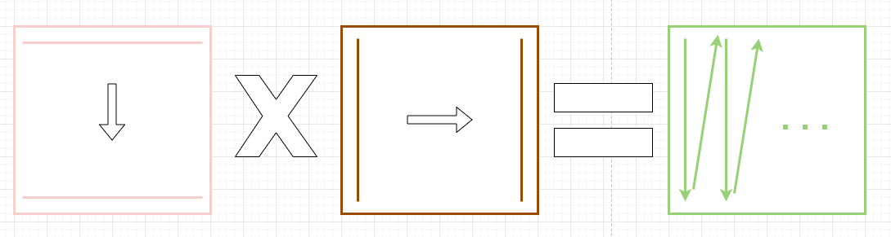
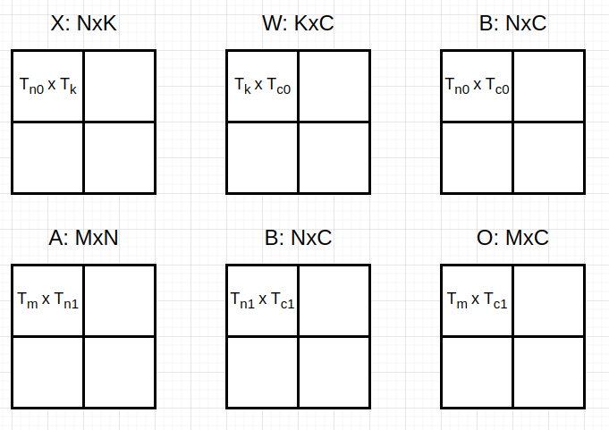
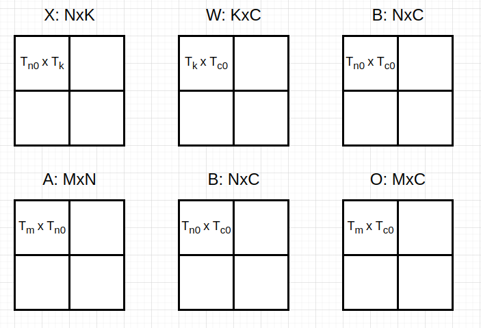
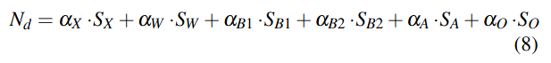
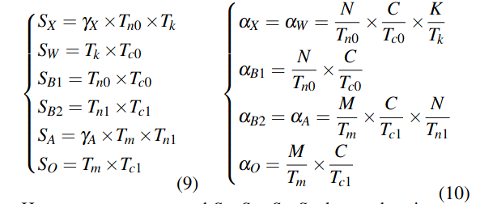
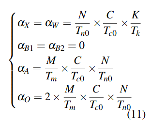
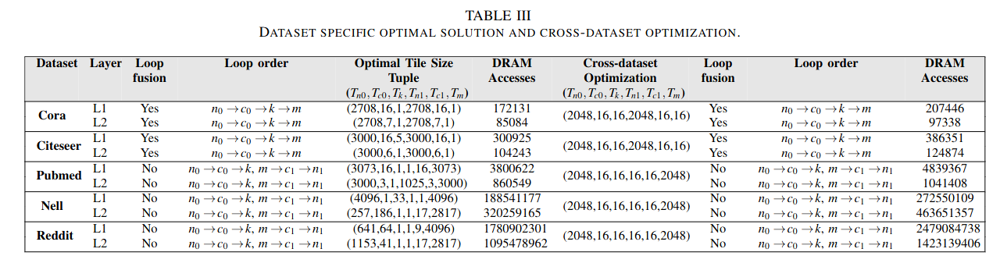
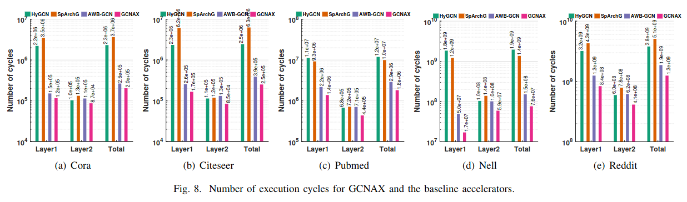
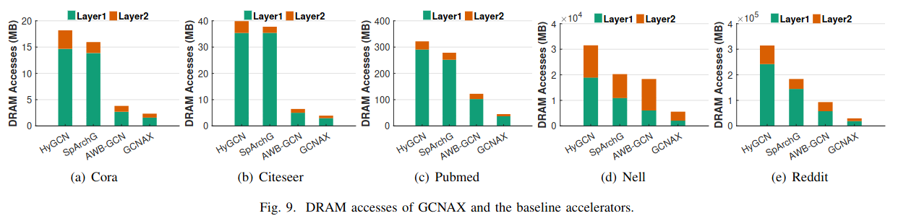
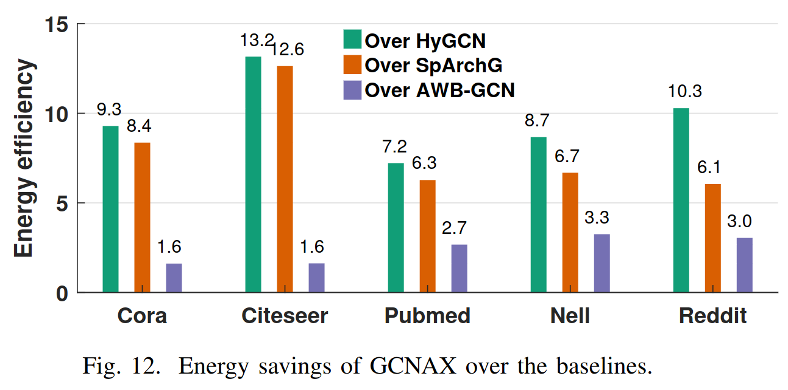

# GCNAX: A Flexible and Energy-efficient Accelerator for Graph Convolutional Neural Networks

GCNAX：一种灵活且能效高的图卷积神经网络加速器  
CCFA  
HPCA  
IEEE International Symposium on High
Performance Computer Architecture  

## INTRODUCTION

- HyGCN分为“组合”和“聚合”两个引擎

  1. 严格按照“组合->聚合”执行，导致更大的计算量和更多的数据访问
  2. 两个引擎之间的工作负载不平衡，数据集在聚合阶段的计算量比组合阶段多，早完成的引擎必须空闲等待较慢的引擎完成

- AWB-GCN没有精心设计循环优化，导致了冗余的数据访问

- 提出了三种优化技术：

  1. loop interchange（循环置换）
  2. loop tiling（循环展开）
  3. loop fusion（循环融合）

## ACCELERATOR DESIGN EXPLORATION

### Execution Order

$A(XW)$

1. 负载均衡
2. 矩阵乘法都是稀疏-稠密格式
3. 计算量小

### Chain Sparse-dense Matrix Multiplication

$X$: NxK  
$W$: KxC  
$B$: NxC  
$A$: MxN  
$O$: MxC  

  
  

#### loop tiling

<Tn0, Tc0, Tk, Tm, Tc1, Tn1>  
矩阵分块如下图所示：  
  

#### loop fusion

- without loop fusion

  片间运算和片内运算均按原始运算顺序，如图所示：  
    

- loop fusion
  1. Tc1=Tc0, Tn1=Tn0 -> <Tn0, Tc0, Tk, Tm>  
  矩阵X W的分片策略决定A B的分片策略，如下图所示：  
    
  2. 计算矩阵O时，不再采用传统方式。得到矩阵B的一个分片后，将矩阵A中所有涉及与矩阵B该分片运算的分片载入并计算，如下图所示：  
    

#### loop interchange

改变循环顺序以减少相应矩阵的内存访问

#### Computation Optimization

其实就是片上计算不再按照传统计算方式了，按照AWB-GCN的计算方式，能有效的略过非零元素，如下图所示：  
  

#### Memory Access Optimization

$N_{d}$：内存总访问次数  
$S$：缓冲区大小  
$\alpha$：迭代次数  
  

没有loop fusion的内存访问次数：  
  

加入loop fusion的内存访问次数：  
  

加入loop fusion后，省去了矩阵B的迭代次数，但是加大了矩阵O的迭代次数，需要通过实现来决定是否分片以及分片大小等操作，结果如图所示：  
  

## GCNAX ARCHITECTURE

  

## Performance

执行时间：GCNAX分别比HyGCN、SpArchG和AWB-GCN快8.9 倍、11.3倍和1.6倍  
  

内存访问：GCNAX比HyGCN减少了5.6-10.6倍的DRAM访问，比SpArchG减少了3.6-10.7倍，比AWB-GCN减少了1.6-3.2.3倍  
  

功耗:与HyGCN、SpArchG和AWB-GCN相比，GCNAX实现了9.5倍、7.7倍和2.3倍的功耗缩减  
  
