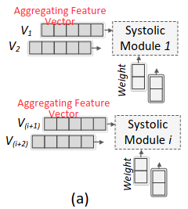

# HyGCN: A GCN Accelerator with Hybrid Architecture

- MLP - multi layer perceptron
- MVM - matrixvector multiplication
- PM - programming model

## Architecture Overview

1. To hide the DRAM access latency, both the Edge Buffer and Input Bufferadopt the **double buffer technique**.
2. Different from normal **systolic array**, our systolic array is **multi-granular(多粒度，有两个模式)** that can be used as **multiple smaller arrays** or **a whole large array** under different optimization scenarios.
3. To improve the bandwidth utilization, a **prefetcher** is designed to explicitly prefetch graph data and parameter data.

## Aggregation Engine

1. Execution Mode
   1. vertex-concentrated

        每个SIMD核心处理一个节点

   2. vertex-disperse

        每个SIMD核心处理一个特
        - all cores are always busy
        - intra-vertex parallelism, the vertex latency is smaller
        - enable the immediate processing of each vertex in the following Combination Engine

        

2. Graph Partitioning (Static)

    

    

3. Data-Aware Sparsity Elimination (Dynamic)

    Window Sliding, Window Shrinking

    

    

## Combination Engine

1. Cooperative Working Mode(vertex-concentrated)

    

2. Independent Working Mode(vertex-disperse)

    

## Inter-Engine Optimization

1. Latency- or Energy-Aware Pipeline

    

2. Coordination of Off-chip Memory Access

    
