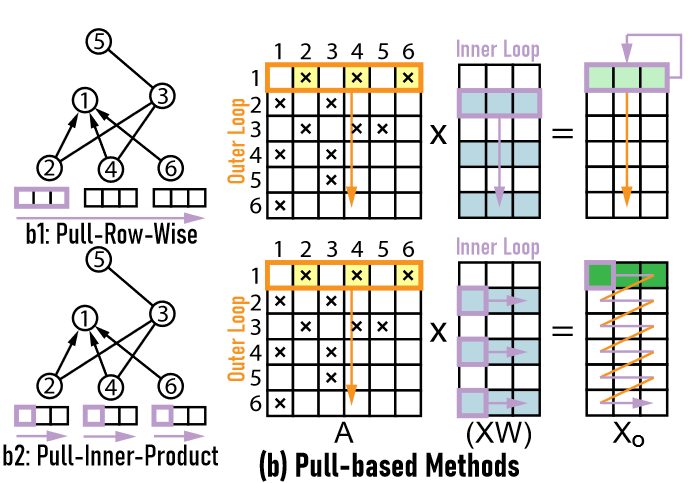
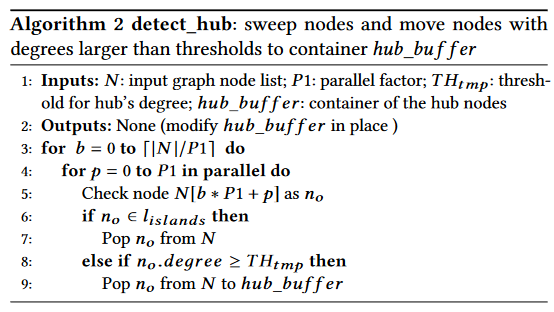
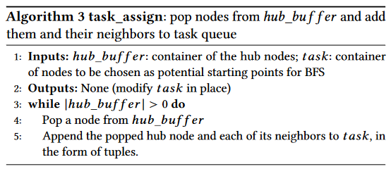

# I-GCN: A Graph Convolutional Network Accelerator with Runtime Locality Enhancement through Islandization

《I-GCN：通过岛屿化增强运行时局部性的图卷积网络加速器》

## INTRODUCTION

GCN加速的两种主要方式：  

1. PULL-based aggregation(HyGCN)

   

   Pull-Row-Wise更好:(1)访问整行更高效；(2)固定处理一行容易并行化

   优点：矩阵A利用率高;中间结果相对较小，可以缓存。

   缺点：效率受制于矩阵(XW)的数据重用。矩阵A非零元素越分散，访问矩阵(XW)的行为越随机，数据重用率越差。

   作者想法：将矩阵A中的同一列的非零元素聚类，重复利用矩阵(XW)的同一行

2. PUSH-based aggregation(AWB-GCN)

   

   PUSH-Column-Wise更好:(1)避免对整个结果矩阵进行片外数据访问

   优点：和Pull-Row-Wise相反，矩阵(XW)利用率高

   缺点：对矩阵Xo的访问变得随机。矩阵Xo的高度等于图中节点的数量，单个列可能无法在芯片上缓冲，需要反复从芯外获取数据。

   作者想法：如果矩阵A的同一行的非零元素能够被聚类，它们可以重用Xo的同一行，从而提高数据重用

解决方案——“岛屿化”

## ALGORITHMS AND ARCHITECTURES

### Execution Order

$A\times \left ( XW \right ) $

### I-GCN Workflow

### Island Locator

### Island Consumer

#### redundant calculation removal

岛屿节点：a，...，g  
枢纽节点：H  
共享邻居：（1）b <-> d e f g（2）c <-> d e f g  
聚合节点b c：节点d e f g使用两次 -> 4 x 2  
聚合节点d e f g：节点b c使用两次 -> 2 x 4  
通过划分子图，将操作次数降低为10

#### Algorithm

岛屿信息发送给Island Consumer后，分配一个PE进行计算，每个PE具有组合、聚合两个引擎

PE计算完K个节点的组合后对这K个节点进行预聚合，组合和聚合并行进行（K可定制）

聚合是从bitmap的左上角开始启用滑动窗口，大小为1xK（K为预聚合的K）  
(1)非零值 < (k/2): 滑动窗口内非零值的特征向量累加  
(2)非零值 >= (k/2): 预聚合结果减去滑动窗口内不连接的节点的特征向量  

## EVALUATION

### Islandization Effect

### Island-based Redundancy Removal

### Cross-platform Comparison

Fig14(A):  
(1)I-GCN  
(2)AWB-GCN  
(3)HyGCN  
(4)PyG-CPU (Intel Xeon E5-2680-V3)  

FIg14(B):  
(1)AWB-GCN  
(2)HyGCN  
(3)SIGMA(SpMM accelerator)  
(4)PyG-based CPU and GPU  
(5)DGL-based CPU and GPUs  
PyG base E5-2680-v3 CPU，9568倍  
DGL base E5-2683-v3 CPU，1243倍  
平均情况下:  
PyG base GPU（RTX8000和V100）， 368倍  
DGL base V100， 453倍  
SIGMA，16倍  
HyGCN AWB-GCN，5.7倍

